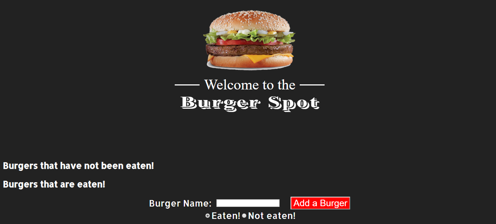

# MVC-Express-Handlebars

- [User Story](#User-Story)
- [General Info](#General-Info)
- [Instructions](#Instructions)
- [Motivation](#Motivation)
- [Future Functionality](#Future-Functionality)
- [References](#References)

## User Story

As a consumer

I want to be able to order, add, and update various food orders of my choosing

So that I can have an accurate and enjoyable eating experience

## General-Info

"Burger Joint" serves as a dynamic interface where users have the ability to order, add, and update burgers of their choosing. The interface features a neatly organized front page where added burgers are moved to either a "Yet to be eaten" or "Devoured" side. The backend of the application is extensive, showcasing knowledge of ORM's and Express-Handlebars. With a specific layout of files and folders, the created MYSQL database responds accurately to every user request. This program is a great setup for possible future applications and helped showcase my knowledge on backend flexibility.

## Instructions

To successfully run this application, the user should first clone the repository into a local file and run npm install. Using the local console, user will run "npm i" on the included dependencies such as "npm i express." After, run "npm run start" and on your local browser, type in "localhost:3000." This will bring up the UX where new burgers can be entered in the bottom search bar. Added burgers will be placed on the left while devoured burgers will be moved to the right.

## Motivation

This project was a great introduction to Orm.js and successfully using Express-Handlebars. Incorporating a complex structure of files and folders was difficult but I enjoyed the organizational structure and planning. Getting more practice with databases and servers was also a good refresher and something I was able to lean on.

## Future Functionality

There are a huge number of future applications for this assignment. Including a "delete" burger option as well as incorporating newer foods would add some needed depth. I can also see this concept being applied to a large scale company, with a system of checks and balances for different departments

## References

https://www.youtube.com/watch?v=msvdn95x9OM&feature=youtu.be

https://blog.bitsrc.io/what-is-an-orm-and-why-you-should-use-it-b2b6f75f5e2a

https://www.npmjs.com/package/express-handlebars
